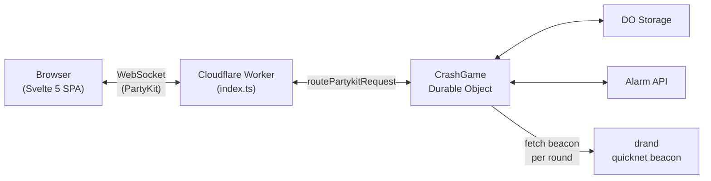
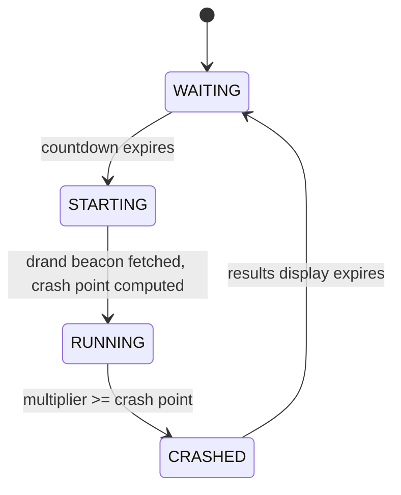
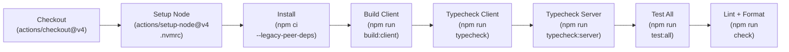

# Crash Override

**A provably fair, real-time multiplayer crash game deployed to the edge.**


**Live:** [crash-override.digitalmachinist.ca](https://crash-override.digitalmachinist.ca)

---

## What Is This?

Crash is a multiplayer betting game where an exponential multiplier climbs from 1.00x until it randomly "crashes." Players place wagers during a 15-second betting window, then watch the multiplier rise -- cashing out before the crash to lock in their payout, or losing their wager if they wait too long.

This implementation is notable for:

- **Provably fair cryptography** -- hash chain + drand beacon ensures the server cannot manipulate outcomes, and players can independently verify every round
- **Edge-deployed architecture** -- Cloudflare Durable Objects serve as the game server with no origin, running the entire game loop via the Alarm API
- **Real-time multiplayer** -- PartyKit WebSocket with auto-reconnect and pending payout recovery
- **Cyberpunk terminal aesthetic** -- CRT overlay, rarity-colored multipliers, threat meter, and terminal display

> **Note:** This is a technical demonstration, not a production gambling platform.

---

## Getting Started

### Prerequisites

- Node.js >= 24.14.0 (see `.nvmrc`)

### Install

```bash
nvm use
npm install
```

### Development

Run in two terminals:

```bash
# Terminal 1: Vite watch mode (rebuilds client on change)
npm run dev:client

# Terminal 2: Wrangler local dev server
npm run dev:server
```

Or start both at once:

```bash
npm run dev
```

The game is served at **http://localhost:8787**.

### Testing

```bash
npm run test          # Unit tests (shared + server logic)
npm run test:svelte   # Svelte component tests (jsdom)
npm run test:workers  # Worker integration tests (@cloudflare/vitest-pool-workers)
npm run test:all      # All three suites in sequence
```

### Type Checking

```bash
npm run typecheck         # Client + shared (default tsconfig)
npm run typecheck:server  # Server (tsconfig.server.json)
```

### Linting & Formatting

```bash
npm run check    # Biome lint + format check (no writes)
npm run format   # Biome format (writes fixes)
npm run lint     # Biome lint only
```

---

## Deployment

The live site at [crash-override.digitalmachinist.ca](https://crash-override.digitalmachinist.ca) is deployed to Cloudflare's edge network. A single Worker serves both the static Svelte SPA and the WebSocket Durable Object from the same domain -- no separate CDN or origin server.


- **CI runs first** -- the existing CI workflow (build, typecheck, test, lint) must pass before deploy
- **Wrangler deploys everything** -- `wrangler deploy` bundles `src/server/` into a Worker, uploads `public/` as static assets, and applies Durable Object migrations
- **Custom Domain** -- configured in the Cloudflare dashboard (Workers & Pages > Settings > Domains & Routes), which auto-provisions DNS and SSL
- **API token** -- stored as `CLOUDFLARE_API_TOKEN` in GitHub Actions secrets, scoped to Workers Scripts, KV Storage, Workers Routes, and DNS for `digitalmachinist.ca`

See [Deployment Plan](docs/plans/2026-03-12-cloudflare-deployment.md) for the full setup walkthrough including Cloudflare dashboard steps, API token permissions, and verification checklist.

---

## Architecture Overview



See [Project Architecture](docs/project-architecture.md) for client/server component diagrams, configuration reference, wrangler bindings, and TypeScript setup.

---

## Technical Highlights

- **Edge-Native Architecture** -- Durable Objects as stateful game servers with `blockConcurrencyWhile` for initialization safety; Alarm API drives the game loop (100ms ticks during RUNNING, 1s ticks during WAITING)
- **Provably Fair Cryptography** -- 10,000-round SHA-256 hash chain with published commitment; per-round crash point derived from chain seed + [drand](https://drand.love/) quicknet beacon via HMAC-SHA256; client-side verification of every round ([details](docs/provably-fair.md))
- **Real-Time Multiplayer** -- PartyKit WebSocket with structured message types, auto-reconnect, and pending payout recovery for disconnected players ([protocol reference](docs/websocket-protocol.md))
- **Svelte 5 Reactive Frontend** -- Writable + derived stores, CSS-driven multiplier animation synced to 100ms server ticks, memoized rarity tier lookups for Borderlands-style multiplier coloring
- **Testing Strategy** -- 3 Vitest configurations (unit, Svelte component via jsdom, Worker integration via `@cloudflare/vitest-pool-workers`); property-based testing with `fast-check` for cryptographic functions
- **Code Quality** -- TypeScript strict mode (separate tsconfigs for client/server), Biome v2 linting and formatting with pre-commit hooks via `simple-git-hooks` + `lint-staged`

---

## Game State Machine



| Phase | Duration | Player Actions | Tick Interval |
|-------|----------|----------------|---------------|
| **WAITING** | 15s | Place/adjust wagers | 1,000ms |
| **STARTING** | Brief | None (locked) | -- |
| **RUNNING** | Variable | Cash out | 100ms |
| **CRASHED** | 10s | View results, verify fairness | -- |

See [Game State Machine](docs/game-state-machine.md) for round lifecycle, void rounds, auto-cashout mechanics, balance management, and alarm error recovery.

---

## CI Pipeline



Triggered on every push and PR to `main`. All steps must pass before merge.

---

## Documentation

| Document | Description |
|----------|-------------|
| [Project Architecture](docs/project-architecture.md) | Deployment model, client/server component diagrams, configuration reference, TypeScript setup, wrangler bindings |
| [Provably Fair System](docs/provably-fair.md) | Hash chain construction, drand integration, HMAC ordering, crash point derivation, client-side verification |
| [WebSocket Protocol](docs/websocket-protocol.md) | Message types, sequence diagrams for all flows (happy path, auto-cashout, reconnect, void rounds) |
| [Game State Machine](docs/game-state-machine.md) | Phase transitions, round lifecycle, multiplier curve, balance management, alarm error recovery |

---

## Project Structure

```
src/
  config.ts                  # All tunable game constants
  types.ts                   # Shared type definitions (messages, state)
  provably-fair.ts           # Shared crash point derivation
  crypto-hex.ts              # Shared hex encoding utilities

  client/
    main.ts                  # Svelte app entry point
    App.svelte               # Root component
    index.html               # HTML shell
    components/              # UI components (BetForm, Multiplier, History, etc.)
    lib/                     # Client logic (stores, socket, verify, balance, etc.)
    public/                  # Static assets (fonts, icons)

  server/
    index.ts                 # Worker entry point + PartyKit routing
    crash-game.ts            # CrashGame Durable Object (game loop, state machine)
    crash-math.ts            # Multiplier curve math
    drand.ts                 # drand beacon fetcher
    game-state.ts            # State management helpers
    hash-chain.ts            # SHA-256 hash chain generation
    validation.ts            # Input validation (wagers, player IDs)

docs/
  project-architecture.md   # Detailed architecture documentation
  provably-fair.md           # Provably fair system deep dive
  websocket-protocol.md      # WebSocket message reference
  game-state-machine.md      # State machine documentation
  specs/                     # Feature specifications
  plans/                     # Implementation plans
  notes/                     # Session notes, audits, research
```

---

## Tech Stack

| Layer | Technology | Version | Purpose |
|-------|-----------|---------|---------|
| Frontend | Svelte | 5.53 | Reactive UI with runes and stores |
| Bundler | Vite | 7.3 | Client build and dev server |
| Runtime | Cloudflare Workers | -- | Edge-deployed serverless compute |
| State | Durable Objects | -- | Stateful game server with storage and alarms |
| WebSocket | partyserver | 0.3.3 | Server-side WebSocket framework |
| WebSocket | partysocket | 1.1.16 | Client-side WebSocket with auto-reconnect |
| Randomness | drand quicknet | -- | Decentralized public randomness beacon |
| Language | TypeScript | 5.9 | Strict mode across client and server |
| Testing | Vitest | 4.1 | Unit, component, and worker integration tests |
| Linting | Biome | 2.4 | Lint + format with pre-commit hooks |
| CI | GitHub Actions | -- | Automated build, test, typecheck, and lint |
| Deploy | Wrangler | 4.75 | Cloudflare Worker bundling and deployment |
