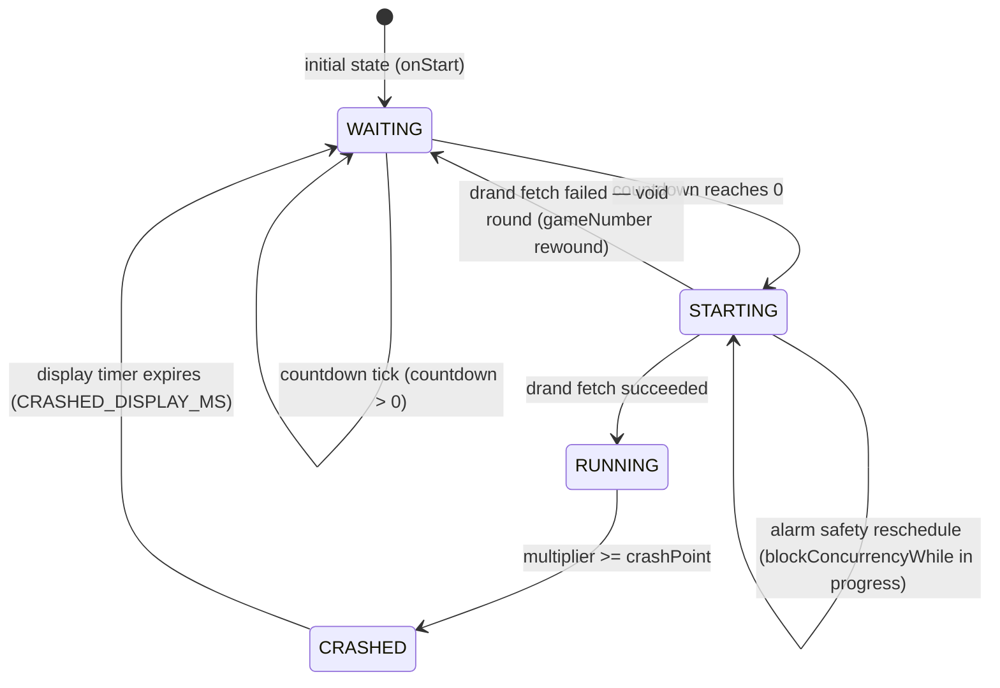
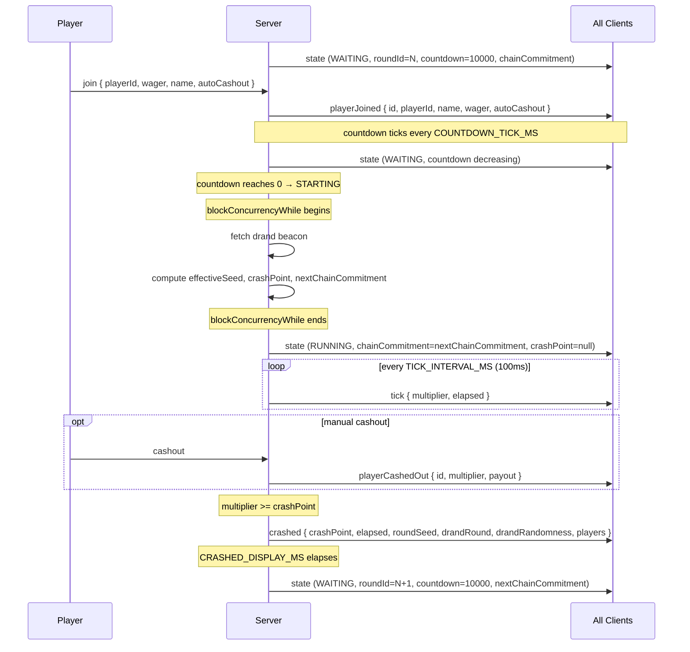
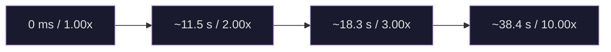
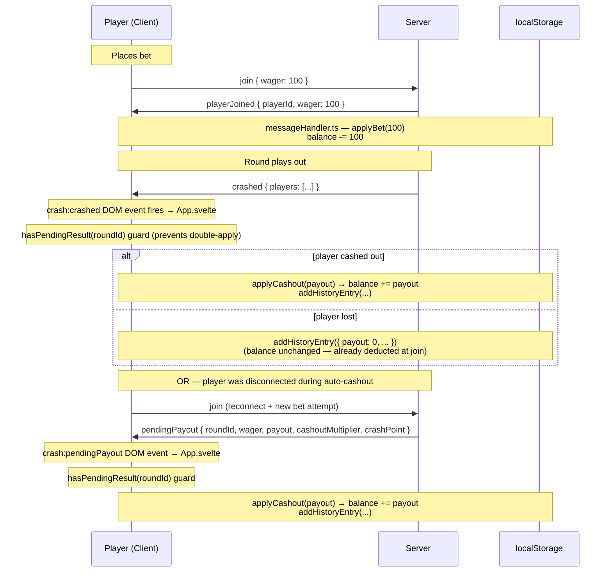

# Game State Machine

## 3.1 Phase State Machine



### Phase summary

| Phase | Duration | Allowed player actions | Server behavior | Alarm interval |
|---|---|---|---|---|
| `WAITING` | `WAITING_DURATION_MS` (10 s) | `join` | Countdown tick, broadcast state | `COUNTDOWN_TICK_MS` (1 s) |
| `STARTING` | Until drand fetch resolves | none | Fetch drand + derive crash point inside `blockConcurrencyWhile` | `COUNTDOWN_TICK_MS` (1 s, safety reschedule only) |
| `RUNNING` | Until crash point hit | `cashout` | Broadcast `tick` every 100 ms, process auto-cashouts | `TICK_INTERVAL_MS` (100 ms) |
| `CRASHED` | `CRASHED_DISPLAY_MS` (5 s) | none | Broadcast `crashed` message with seeds and player results | `CRASHED_DISPLAY_MS` (single alarm) |

---

## 3.2 Void Rounds

A void round occurs when `fetchDrandBeacon` throws a `DrandFetchError` during the STARTING phase.

**Server behavior** (`src/server/crash-game.ts`, `startRound()`):

1. `gameNumber` was incremented before the fetch attempt; it is decremented back (`gameNumber -= 1`) to reuse the same chain seed next attempt.
2. Phase is reset to `WAITING` with a full `countdown = WAITING_DURATION_MS`.
3. `persistState()` is called to prevent seed loss across a potential DO eviction.
4. A new alarm is scheduled (`COUNTDOWN_TICK_MS` from now) to restart the countdown.
5. No `crashed` or `playerJoined` messages are sent; the round never began from the client's perspective.

**Effect on players**: Players whose `join` was processed during WAITING remain in `gameState.players`, but the round never started. They effectively participate in the re-scheduled round (same WAITING phase, same players, new countdown). Balance is unaffected (bet deduction only happens on `playerJoined` confirmation, which already occurred).

---

## 3.3 Round Lifecycle



---

## 3.4 Player State Within a Round

| Action | Phase constraint | Server response | Notes |
|---|---|---|---|
| `join` | WAITING only | `playerJoined` broadcast (or `error`) | Duplicate join rejected; wager must be `> 0` and finite |
| `cashout` (manual) | RUNNING only | `playerCashedOut` broadcast (or `error`) | Player identified by `conn.id` (connection ID), not message payload |
| Auto-cashout | RUNNING, server-triggered | `playerCashedOut` broadcast | Processed in `handleTick` at exact target multiplier |

**Player identification on cashout**: The `cashout` message has no payload (`{ type: 'cashout' }`). The server looks up the player by matching `conn.id` to `player.id` in `gameState.players`. This means only the active connection can cashout; a reconnected player gets a new `conn.id`.

**Player map key**: `gameState.players` is a `Map<string, Player>` keyed by `playerId` (stable UUID), not connection ID. This allows the server to track disconnected players' auto-cashout targets.

---

## 3.5 Disconnect Semantics

**`onClose` is intentionally a no-op** in `src/server/crash-game.ts`. There is no cleanup of `gameState.players` on disconnect. This is deliberate:

- Disconnected players' entries persist in `gameState.players`.
- Auto-cashout targets continue to be evaluated in `handleTick` on every alarm tick.
- If an auto-cashout fires for a disconnected player, `crashRound()` detects that the player's `conn.id` is not in `this.getConnections()` and stores the payout as a `PendingPayout` in `this.pendingPayouts` (a `Map<playerId, PendingPayout>`).

**Pending payout delivery**:

- On reconnect, the client sends a `join` message (including its `playerId`).
- `onMessage` in `crash-game.ts` checks `this.pendingPayouts.get(msg.playerId)` before processing the join.
- If a pending payout exists, it is sent immediately to the reconnecting connection as a `pendingPayout` message, then removed from the map and state is persisted.
- `pendingPayouts` is keyed by `playerId` (stable localStorage UUID), not connection ID.

---

## 3.6 Multiplier Curve

```
multiplier(t) = e^(GROWTH_RATE × t)
```

where `t` is elapsed milliseconds since round start and `GROWTH_RATE = 0.00006`.

Inverse (used to precompute the crash time in `handleStartingComplete`):

```
crashTimeMs(crashPoint) = ln(crashPoint) / GROWTH_RATE
```

**Reference points:**

| Elapsed time | Multiplier |
|---|---|
| 0 ms | 1.00x |
| 11,552 ms (~11.5 s) | 2.00x |
| 18,310 ms (~18.3 s) | 3.00x |
| 38,377 ms (~38.4 s) | 10.00x |



**Client animation**: The multiplier display uses a CSS transition matching `TICK_INTERVAL_MS` (100 ms) applied directly in `Multiplier.svelte`. There is no tweened Svelte store — the transition is `transition: all 100ms linear` on the displayed value.

---

## 3.7 Auto-Cashout

- Set by the player in the `join` message (`autoCashout: number | null`).
- Processed server-side in `handleTick()` (`src/server/game-state.ts`) on every alarm tick.
- When `currentMultiplier >= player.autoCashout`, the cashout is recorded using the player's **exact `autoCashout` target**, not the current tick multiplier.

```typescript
// game-state.ts — auto-cashout processing in handleTick
const autoCashoutMultiplier = player.autoCashout;           // exact target
const payout = Math.floor(player.wager * autoCashoutMultiplier * 100) / 100;
```

This guarantees the player receives the multiplier they requested (no overshoot penalty). The payout is floored to 2 decimal places.

---

## 3.8 Balance Management

Balance is stored in `localStorage` only — there is no server-side balance authority.



**Key accounting rules**:

| Rule | Detail |
|---|---|
| Bet deduction | `applyBet()` called in `messageHandler.ts` on `playerJoined` (server confirmation), **not** on bet submit |
| Payout credit | `applyCashout()` called in `App.svelte` on `crash:crashed` or `crash:pendingPayout` |
| Double-apply guard | `hasPendingResult(roundId)` checks localStorage history before applying any result |
| Loss recording | No balance change — wager was deducted at join. `addHistoryEntry` records `payout=0` |
| Player ID | `getOrCreatePlayerId()` in `balance.ts` generates a stable UUID via `crypto.randomUUID()`, stored in localStorage under `crashPlayerId` |

**Type distinction**: `RoundResult` (localStorage, in `src/types.ts`) is the client-side record per bet (includes `wager`, `cashoutMultiplier`, `crashPoint`, `timestamp`). `HistoryEntry` (server-broadcast) is per-round public data (includes `roundSeed`, `drandRound`, `drandRandomness`, `chainCommitment`). They are different types with different purposes.

---

## 3.9 State Persistence

The Durable Object stores all persistent data under a **single key** `'gameData'` in DO Storage.

**Stored value shape** (`persistState()` in `crash-game.ts`):

```typescript
{
  rootSeed: string;
  gameNumber: number;
  chainCommitment: string;
  history: HistoryEntry[];                      // last HISTORY_LENGTH (20) rounds
  pendingPayouts: Array<[string, PendingPayout]>; // serialized Map entries
}
```

**When persistence happens**:
- After every `crashed` transition (`crashRound()` → `persistState()`).
- After void rounds (drand fetch failure) — to preserve the rewound `gameNumber` and state.
- After a pending payout is consumed (`onMessage` join path).
- **Not** after every tick (RUNNING phase has no persistence).

**`chainCommitment` in storage**: The stored `chainCommitment` is the value from `this.gameState.chainCommitment` at crash time, which equals `SHA-256(chainSeed_for_that_game)`. On restart (`onStart`), `createInitialState` is called with this value, so the commitment is correctly restored without recomputing the chain.

**`PendingPayout` interface** is defined locally in `crash-game.ts` and is not exported via `src/types.ts`:

```typescript
interface PendingPayout {
  roundId: number;
  wager: number;
  payout: number;
  cashoutMultiplier: number;
  crashPoint: number;
}
```

---

## 3.10 Alarm Error Recovery

The `onAlarm()` game loop uses a **try/catch/finally** strategy to guarantee the alarm is always rescheduled, even after unexpected errors. This prevents the game loop from permanently dying ("alarm loop death").

**Cloudflare output gate constraint**: Cloudflare Durable Objects use an "output gate" that rolls back side effects (including `setAlarm()`) if the handler throws. This means a `setAlarm()` in the `finally` block is only durable if the `finally` block itself completes without throwing.

**Three failure chains and their mitigations**:

| Failure | Risk | Mitigation |
|---|---|---|
| `this.broadcast()` throws in `catch` block (broken WebSocket connection) | Exception propagates out of catch → CF output gate rolls back `finally` block's `setAlarm()` → alarm loop dies | `broadcast()` call in catch block is wrapped in its own try/catch |
| `crashRound()` returns early (missing provably-fair ingredients) | Caller sets `alarmScheduled = true` after the call, but no alarm was actually scheduled → finally block skips recovery → alarm loop dies | Guard throws instead of returning, so catch/finally recovery fires |
| Recovery alarm uses wrong interval for current phase | RUNNING phase recovers at 1 s (`COUNTDOWN_TICK_MS`) instead of 100 ms (`TICK_INTERVAL_MS`) → visible stutter to players | Finally block checks `gameState.phase` and uses `TICK_INTERVAL_MS` for RUNNING, `COUNTDOWN_TICK_MS` otherwise |

**`alarmScheduled` flag**: Set to `true` only after a successful `setAlarm()` or a method that internally schedules one (`startRound`, `crashRound`, `nextRound`). If the try block throws before setting this flag, the finally block knows it must schedule a recovery alarm.

**Recovery flow**:

```
onAlarm()
├── try: run phase handler, set alarmScheduled = true
├── catch: log error, broadcast "retrying" (guarded)
└── finally: if (!alarmScheduled) → setAlarm(phase-appropriate interval)
```
