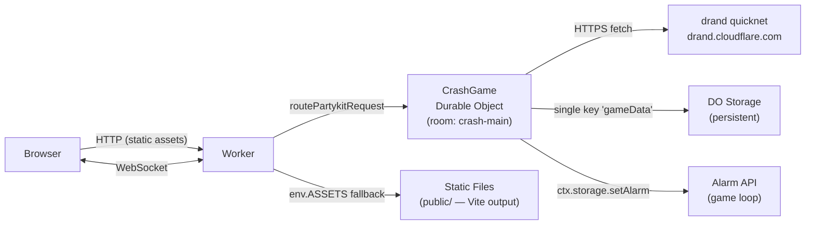
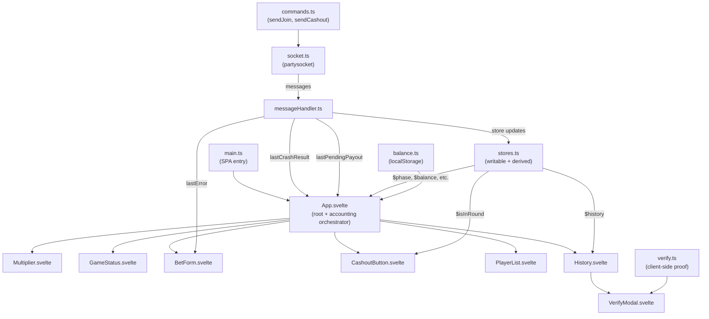
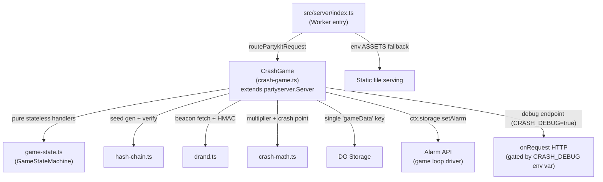

# Project Architecture

## 1.1 Technology Stack

| Layer | Technology | Notes |
|---|---|---|
| Runtime | Cloudflare Workers + Durable Objects | Single `CrashGame` DO per room |
| WebSocket framework | `partyserver` / `partysocket` | Abstracts DO lifecycle and reconnection |
| Frontend | Svelte 5 (Vite, no SvelteKit) | Built to `public/` directory |
| Randomness | drand quicknet via Cloudflare relay | `drand.cloudflare.com` |
| Build | Vite (client) + Wrangler (server) | Separate build pipelines |
| Language | TypeScript (strict mode) | Two separate tsconfig files |
| Node | v20.20.1 | Required for component tests (`node:util` `styleText`) |
| Linter | Biome v2 | Pre-commit via `simple-git-hooks` + `lint-staged` |

---

## 1.2 Deployment Architecture



**Request routing** (`src/server/index.ts`):
1. `routePartykitRequest` handles all WebSocket and party upgrade requests → routed to `CrashGame` DO.
2. All other requests fall through to `env.ASSETS` (auto-generated binding from `[assets]` in `wrangler.toml`), which serves the Vite-built frontend from `public/`.

**Single room**: All players share one `CrashGame` DO instance identified by room ID `crash-main`. Changing `ROOM_ID` in `src/config.ts` creates a new isolated DO instance with no shared state.

---

## 1.3 Client Architecture



**Store-based handoff**: `messageHandler.ts` writes three signal stores to communicate round events to UI components:

| Store | Dispatcher | Consumer | Purpose |
|---|---|---|---|
| `lastCrashResult` | `messageHandler.ts` | `App.svelte` | Round result accounting (cashout/loss) |
| `lastPendingPayout` | `messageHandler.ts` | `App.svelte` | Reconnect payout delivery |
| `lastError` | `messageHandler.ts` | `BetForm.svelte` | Server validation errors |

**Derived stores** (computed from `gameState`):
- `phase` — current `Phase` value
- `countdown` — ms remaining in WAITING
- `playersList` — `Object.values($players)` array
- `isInRound` — true when phase is `RUNNING` or `STARTING`, player is in `$players`, and has not cashed out

**localStorage keys**: `crashBalance` (balance), `crashHistory` (round results), `crashPlayerId` (stable UUID).

---

## 1.4 Server Architecture



**`game-state.ts`** contains all pure (no I/O) state transition functions: `handleJoin`, `handleCashout`, `handleTick`, `handleCrash`, `handleStartingComplete`, `handleCountdownTick`, `transitionToWaiting`, `buildStateSnapshot`. Each returns `{ state, messages }` (plus optional flags); `CrashGame` then broadcasts/sends the returned messages.

**`PendingPayout` interface** is defined locally in `crash-game.ts` (not exported via `types.ts`), keyed by stable `playerId` UUID.

---

## 1.5 Configuration Reference

All constants are defined in `src/config.ts`.

### Game Loop Timing

| Constant | Value | Unit | Description | Tuning |
|---|---|---|---|---|
| `WAITING_DURATION_MS` | `10_000` | ms | Countdown before each round | Decrease for faster rounds; minimum ~3 s to allow bets |
| `CRASHED_DISPLAY_MS` | `5_000` | ms | Results screen duration | Controls how long crash info is visible before next round |
| `TICK_INTERVAL_MS` | `100` | ms | Server broadcast interval during RUNNING | Lower = smoother client animation; higher = less bandwidth |
| `COUNTDOWN_TICK_MS` | `1_000` | ms | State broadcast interval during WAITING | Drives per-second countdown display |

### Multiplier Curve

| Constant | Value | Description |
|---|---|---|
| `GROWTH_RATE` | `0.00006` | Exponential growth exponent: `multiplier(t) = e^(GROWTH_RATE × t)` |

Reference points at `GROWTH_RATE = 0.00006`:

| Multiplier | Time |
|---|---|
| 2.00x | ~11.5 s |
| 3.00x | ~18.3 s |
| 10.00x | ~38.4 s |

Increasing `GROWTH_RATE` makes the multiplier climb faster (shorter average rounds). Decreasing it extends rounds.

### House Edge

| Constant | Value | Description |
|---|---|---|
| `HOUSE_EDGE` | `0.01` | Fraction of wagers retained (1%). Encoded as `(1 - HOUSE_EDGE) * 100` in `crash-math.ts`. |

> **Known sync dependency**: `HOUSE_EDGE` is used via the config constant in `src/server/crash-math.ts`, but `src/client/lib/verify.ts` hardcodes the equivalent value as the literal `99` (`floor(99 / (1 - h)) / 100`). Both files **must be updated together** if the house edge changes. See §2.6 in `docs/provably-fair.md` for the formula detail.

### Hash Chain

| Constant | Value | Description | Tuning |
|---|---|---|---|
| `CHAIN_LENGTH` | `10_000` | Games per hash chain | Increasing extends the interval between seed rotations |
| `CHAIN_ROTATION_THRESHOLD` | `100` | Games remaining before rotation | Increasing gives more lead-time to detect rotation |

### drand Quicknet

| Constant | Value | Description |
|---|---|---|
| `DRAND_CHAIN_HASH` | `52db9ba7...` | Quicknet chain identifier |
| `DRAND_GENESIS_TIME` | `1_692_803_367` | Unix seconds — quicknet genesis |
| `DRAND_PERIOD_SECS` | `3` | Beacon interval (seconds) |
| `DRAND_FETCH_TIMEOUT_MS` | `2_000` | Per-attempt HTTP timeout |

> These values are tied to the drand quicknet deployment (`drand.cloudflare.com`). Do not change them without coordinating with the drand network configuration.

### History and Room

| Constant | Value | Description |
|---|---|---|
| `HISTORY_LENGTH` | `20` | Completed rounds kept in server state broadcast |
| `CLIENT_HISTORY_LIMIT` | `50` | Rounds kept in localStorage |
| `ROOM_ID` | `'crash-main'` | DO room identifier — changing creates a new isolated instance |

---

## 1.6 TypeScript Configuration

Two separate `tsconfig` files to avoid conflicting type definitions:

| File | Scope | Key settings |
|---|---|---|
| `tsconfig.json` | Client (`src/client/`, `src/`) | DOM lib, excludes `src/server/**` |
| `tsconfig.server.json` | Server (`src/server/`) | `@cloudflare/workers-types`, excludes `src/client/**` |

Commands:
```bash
npm run typecheck          # client typecheck
npm run typecheck:server   # server typecheck
```

---

## 1.7 Wrangler Bindings

Defined in `wrangler.toml`:

| Binding | Type | Description |
|---|---|---|
| `CrashGame` | Durable Object | Single DO class; migration tag `v1` |
| `ASSETS` | Auto-binding | Serves `./public` (Vite build output); generated from `[assets]` section |
| `CRASH_DEBUG` | Var | Set `"true"` to enable debug HTTP endpoint on the DO |

> The `CRASH_DEBUG` var is set to `"true"` by default in `wrangler.toml` (local dev). Remove or set to `"false"` in production deployments.

---

## 1.8 Build & Development

```bash
# Run both dev servers (separate terminals)
npm run dev:server     # wrangler dev (server + DO + WebSocket)
npm run dev:client     # vite dev (Svelte HMR)

# Build
npm run build:client   # vite build → public/

# Tests
npm run test                                            # unit tests (vitest)
npm run test:workers                                    # server worker tests
~/.nvm/versions/node/v20.20.1/bin/node ./node_modules/.bin/vitest run \
  --config vitest.svelte.config.ts                     # component tests (requires Node ≥20.12)

# Type checking
npm run typecheck          # client
npm run typecheck:server   # server

# Lint / format
npm run lint       # biome lint src
npm run format     # biome format src --write
npm run check      # biome check src (lint + format)
```

> Component tests require Node v20.20.1 (for `node:util` `styleText`). The system default Node may be older; use the full NVM path shown above.
