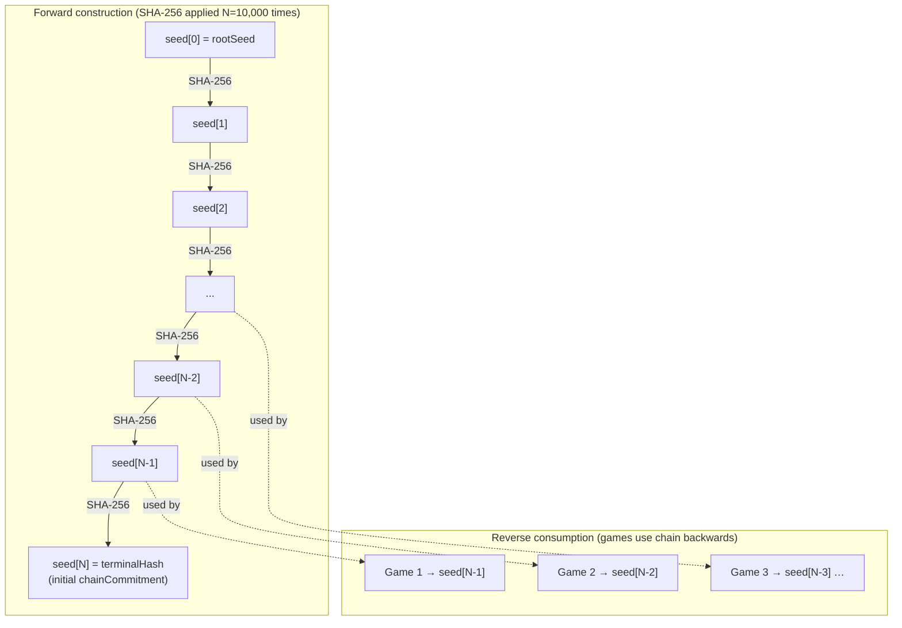
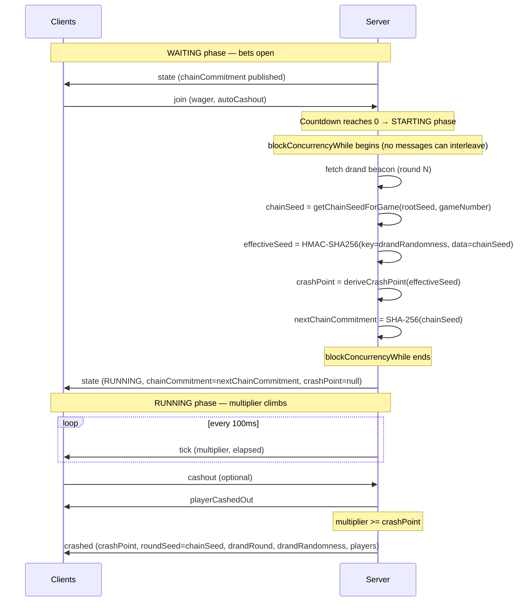
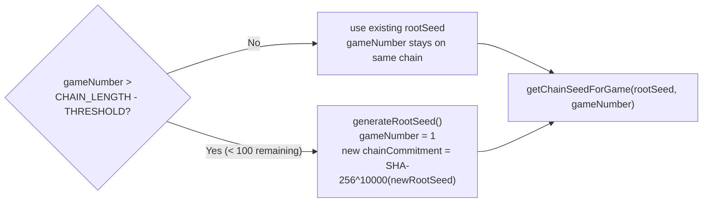

# Provably Fair System

---

## 2.0 Plain-English Explainer

*This section is written for any player who wants to understand whether the game is fair. No technical background required.*

### The problem with normal online games

In a typical online casino, the server decides the outcome and then tells you what it was. You have no way to check whether the result was chosen honestly or was rigged after you placed your bet. You have to trust the operator completely.

### How this game is different — in one sentence

We decide the crash point **before** you place your bet, lock it in with a public promise, and then reveal all the ingredients after the round so you can verify it yourself.

### The sealed-envelope analogy

Imagine you write a secret number on a piece of paper, seal it in an envelope, and hand it to a stranger before any bets are placed. You can't change what's inside the envelope once it's sealed and in someone else's hands. After the round, you open the envelope in public and everyone can verify the contents match what came out.

That's exactly what this game does — except the "envelope" is a cryptographic hash, which is mathematically impossible to fake or reverse-engineer.

### The independent coin flip (drand)

Even with the sealed envelope, you might wonder: "did you choose a number that conveniently makes the house win?" To prevent that, we mix our sealed number with a random value produced by **drand** — an independent public lottery run by universities and research institutions around the world. Nobody controls drand, not even us.

Crucially: **we do not know the crash point of any future round ourselves** until wagers have been placed and that round begins. The final result only becomes knowable at the exact moment we fetch the drand value. Even if we wanted to cheat, the outcome is out of our hands once you've bet.

### The exact sequence

1. Before any bets: we publish a fingerprint (the "chain commitment") — like the sealed envelope.
2. You place your bet during the countdown.
3. The round starts. We fetch the latest drand value (public, timestamped, immutable). We combine it with our pre-committed seed to produce the crash point. Neither ingredient alone is enough — you need both.
4. The multiplier climbs. You decide when to cash out.
5. When the round ends, we reveal the seed we used.
6. You can verify: the revealed seed matches the fingerprint we published, and re-computing the crash point from seed + drand gives the same number you saw.

### What we cannot fake

- **We cannot change the crash point after bets are placed.** The chain commitment is already public.
- **We cannot choose a convenient drand value.** drand is operated by independent parties.
- **We cannot know any future crash point in advance.** The result doesn't exist until drand produces its value at the start of that round.

### How to verify any round

Click **"Verify"** next to any round in the history panel. The page re-computes the crash point from the public ingredients and shows you whether it matches. No special software, no downloads, no trust required.

---

## 2.1 Overview & Goals

The provably fair system provides two guarantees:

1. **Pre-commitment**: The crash point is fixed before any bets are placed and cannot be changed after betting opens.
2. **Verifiability**: After a round, anyone can independently re-derive the crash point from the publicly revealed seed and drand value and confirm it matches what was displayed.

The design uses two layers of cryptographic commitment:
- A **hash chain** that commits to a sequence of game seeds in advance (via the `chainCommitment` broadcast).
- A **drand beacon** that contributes independent external randomness, preventing the server from choosing seeds to produce favorable outcomes.

---

## 2.2 Hash Chain

### Construction and consumption



`N = CHAIN_LENGTH = 10,000`

### Two numbering systems — important disambiguation

| Term | Direction | Index 0 | Index 10,000 |
|---|---|---|---|
| **Chain index** | Forward (rootSeed → terminalHash) | `rootSeed` | `terminalHash` |
| **Game number** | 1, 2, 3 … consuming the chain in **reverse** | — | — |

The mapping: **Game k uses chain index `CHAIN_LENGTH − k`** (`src/server/hash-chain.ts`, `getChainSeedForGame`).

- Game 1 → `seed[9999]` (index `N−1`)
- Game 2 → `seed[9998]` (index `N−2`)
- Game k → `seed[N−k]`

### Why reverse order?

The `terminalHash` (`seed[N]`) is published at the very start as the `chainCommitment` in the initial state broadcast. It commits to the entire future sequence of seeds. Because SHA-256 is a one-way function:

- Publishing `seed[N]` does not reveal `seed[N−1]` (game 1's seed).
- Revealing `seed[N−1]` proves it was pre-committed, because `SHA-256(seed[N−1]) = seed[N]` — anyone can verify this.
- The server cannot retroactively swap `seed[N−1]` for a different value without breaking the SHA-256 relationship.

### Chain link verification

```
SHA-256(seed[k]) === seed[k+1]    ← chain index notation

In game terms:
SHA-256(game_k.roundSeed) === game_k.chainCommitment
```

Adjacent rounds are also verifiable as a chain:

```
game_k.roundSeed === game_(k+1).chainCommitment
```

i.e., each game's revealed seed is the value that the *next* game committed to. The full sequence traces back to `terminalHash`.

### Chain length and rotation

- Length: `CHAIN_LENGTH = 10,000` games per chain.
- Rotation threshold: `CHAIN_ROTATION_THRESHOLD = 100` — when fewer than 100 games remain, a new `rootSeed` is generated and the `chainCommitment` resets to the new `terminalHash`. No round is interrupted. See §2.8.

---

## 2.3 drand Beacon Integration

### What drand is

[drand](https://drand.love) is a decentralized randomness beacon. The **quicknet** chain produces a new random value every 3 seconds. Each value is signed by a threshold of independent nodes (universities, research institutions) and is publicly verifiable. No single party — including the operators of this game — can predict or control drand output.

### Why it is needed

Without drand, a malicious server could pre-select seeds that produce favorable crash points. By mixing in a drand value that is only knowable at round start (after bets), the server cannot influence the final crash point — even if it controls the entire hash chain.

### Fetch mechanics (`src/server/drand.ts`)

- **Primary URL**: `{DRAND_BASE_URL}/public/{round}` (specific round number)
- **Fallback URL**: `{DRAND_BASE_URL}/public/latest`
- **Timeout**: `DRAND_FETCH_TIMEOUT_MS = 2,000 ms` per attempt
- **Error type**: `DrandFetchError` — thrown when both URLs fail; triggers a void round (see §2.3 and §3.2)

### Round timing

`getCurrentDrandRound()` computes the expected round number from the current wall-clock time:

```
round = floor((nowSec − DRAND_GENESIS_TIME) / DRAND_PERIOD_SECS) + 1
```

`drandRoundTime(round)` is the inverse — converts a round number back to a Unix timestamp. Useful for debugging timing drift.

### `DrandBeacon` interface

```typescript
interface DrandBeacon {
  round: number;
  randomness: string;  // 64-char hex
  signature: string;
}
```

---

## 2.4 Effective Seed Computation



**Key security point**: `crashPoint` is `null` in all `state` and `tick` messages. It is only revealed in the `crashed` message, after the round has ended. This prevents any client from using foreknowledge of the crash point.

---

## 2.5 HMAC Ordering — Security-Critical Detail

The effective seed is computed as:

```
effectiveSeed = HMAC-SHA256(key = drandRandomness, data = chainSeed)
```

**The drand randomness is the HMAC key**, not the data. This is a deliberate security choice.

### Why the key position matters

In HMAC, the key is the privileged input that determines the output domain. If the positions were reversed:

```
# INSECURE — do not do this:
effectiveSeed = HMAC-SHA256(key = chainSeed, data = drandRandomness)
```

…a malicious server could search for a `chainSeed` value such that `HMAC(chainSeed, drandRandomness)` produces any desired output for a *known* drand value. Since drand values are public and predictable (published on a 3-second schedule), a bad actor with enough computation could cherry-pick seeds.

With the correct ordering — drand as the **key** — the server cannot choose seeds to cancel out or exploit drand's entropy. The uncontrollable external input occupies the privileged position.

This ordering is used consistently in both `src/server/drand.ts` (`computeEffectiveSeedFromBeacon`) and `src/client/lib/verify.ts` (`computeEffectiveSeed`).

---

## 2.6 Crash Point Derivation

### Step 1 — `hashToFloat`

```typescript
// src/server/crash-math.ts and src/client/lib/verify.ts
function hashToFloat(hex: string): number {
  return parseInt(hex.slice(0, 13), 16) / 2**52;
}
```

Takes the first 13 hex characters of the effective seed (52 bits, matching JS `float64` mantissa precision) and maps them to a float `h` in `[0, 1)`.

### Step 2 — Crash point formula

**Server** (`src/server/crash-math.ts`) — parameterized:
```
crashPoint = max(1.00, floor((1 − HOUSE_EDGE) × 100 / (1 − h)) / 100)
```

**Client** (`src/client/lib/verify.ts`) — hardcoded:
```
crashPoint = max(1.00, floor(99 / (1 − h)) / 100)
```

> **Known technical debt**: The two formulas are numerically equivalent when `HOUSE_EDGE = 0.01` (the default), but would diverge if the house edge is changed. If `HOUSE_EDGE` is updated in `src/config.ts`, the literal `99` in `src/client/lib/verify.ts` must also be updated. See `docs/project-architecture.md §1.5` for the sync dependency note.

### Distribution properties

- When `h` is close to 1 (unlikely), the division blows up → large crash points (rare, big multipliers).
- When `h` is close to 0, `1 / (1 − h) ≈ 1` → crash point ≈ 1.00.
- Approximately 1% of rounds crash at 1.00x (instant crash), matching the house edge.
- The distribution has an exponential tail: most rounds crash between 1x and 3x, with diminishing probability of higher multipliers.

---

## 2.7 Client-Side Verification

### How `verify.ts` works

`verifyRound(params)` in `src/client/lib/verify.ts` performs two checks:

1. **Chain link check**: `SHA-256(roundSeed) === chainCommitment`
   - Confirms the revealed seed is consistent with the commitment stored in the history entry.
   - `chainValid: boolean` in `VerificationResult`.

2. **Crash point check**: Re-derive `effectiveSeed = HMAC(key=drandRandomness, data=roundSeed)`, then `crashPoint = deriveCrashPoint(effectiveSeed)`.
   - Compare against `displayedCrashPoint` with ±0.001 floating-point tolerance.
   - If they differ by more than 0.001, result is `{ valid: false, reason: 'crash point mismatch' }`.

Both checks must pass for `valid: true`.

### `VerificationResult` type

```typescript
interface VerificationResult {
  valid: boolean;
  reason?: string;           // 'chain link invalid' | 'crash point mismatch'
  computedCrashPoint?: number;
  chainValid?: boolean;
  drandRound?: number;
  drandRandomness?: string;
}
```

### VerifyModal display

`src/client/components/VerifyModal.svelte` shows (truncated for readability):

| Field | Source |
|---|---|
| Crash point | `entry.crashPoint` |
| Round seed | `entry.roundSeed.slice(0, 16)...` |
| drand round | `entry.drandRound` |
| Chain commitment | `entry.chainCommitment.slice(0, 16)...` |
| Verification status | result of `verifyRound(...)` |

Verification runs on `onMount` (client-side only, no server request).

---

## 2.8 Chain Rotation

When `gameNumber > CHAIN_LENGTH − CHAIN_ROTATION_THRESHOLD` (i.e., fewer than 100 games remain in the current chain), `startRound()` in `crash-game.ts` triggers a rotation:



- A fresh `rootSeed` is generated using `crypto.getRandomValues`.
- `gameNumber` resets to `1`.
- The new `terminalHash` (= `computeTerminalHash(newRootSeed)`) becomes the new `chainCommitment` and is immediately broadcast to all clients.
- No round is interrupted; rotation happens at the start of a normal `startRound()` call.
- The old chain's seeds remain in the broadcast history for continued verification of past rounds.
