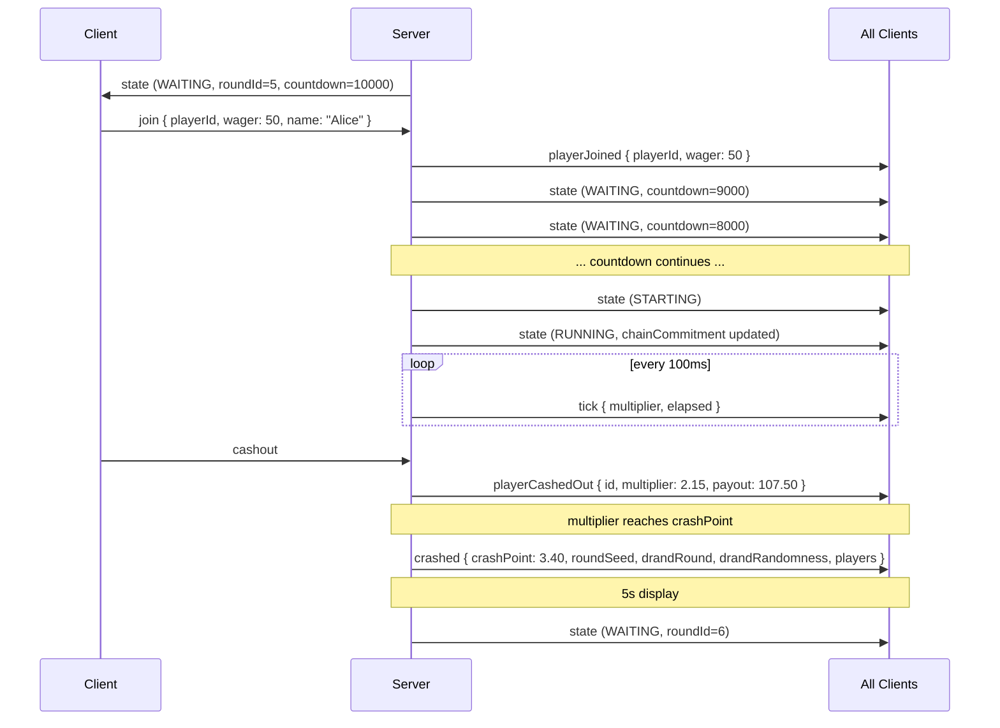
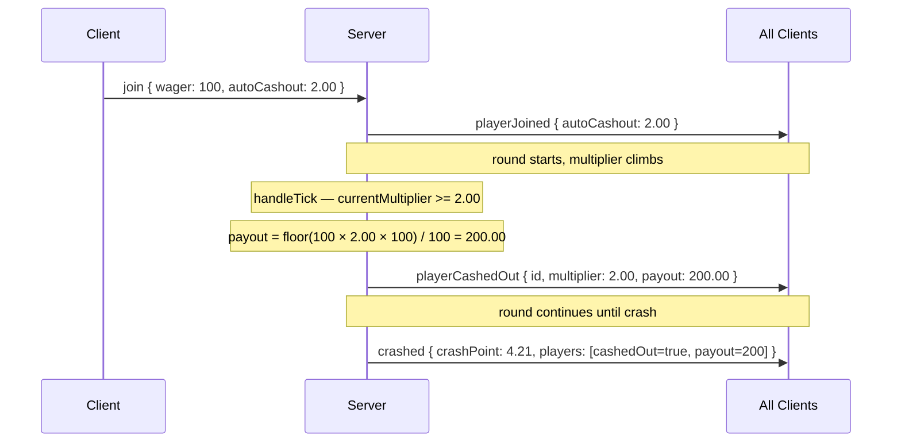
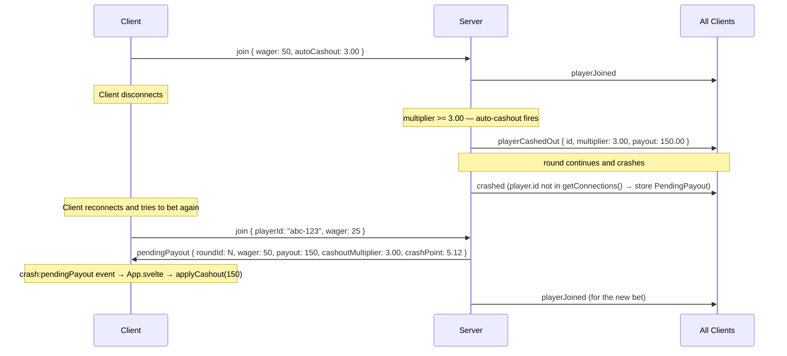
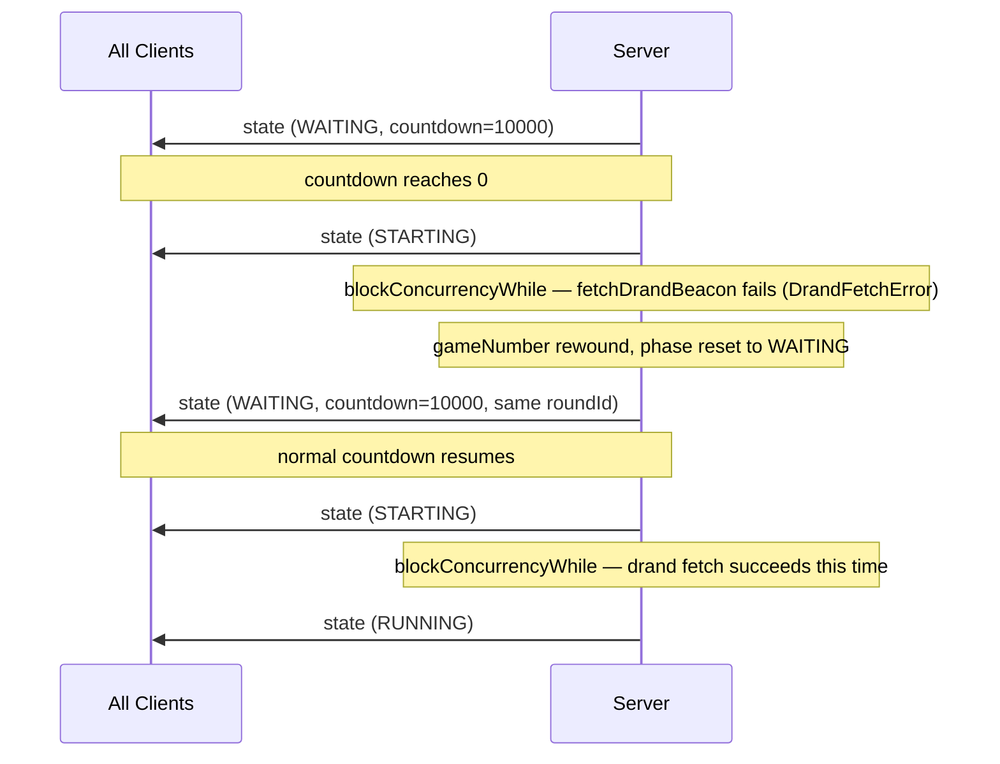

# WebSocket Protocol Reference

## 4.1 Connection

| Property | Value |
|---|---|
| Transport | WebSocket via `partysocket` (auto-reconnect) |
| Room | `crash-main` |
| Party | `crash-game` |

**Connection lifecycle** (`src/client/lib/socket.ts`):

1. `connect()` creates a `PartySocket` connecting to the current `window.location.host`.
2. On `open`: `connectionStatus` store → `'connected'`.
3. On `close`: `connectionStatus` store → `'reconnecting'`; `multiplierAnimating` → `false`.
4. On initial connect: server immediately sends a full `state` message with the current game state.

**`connectionStatus` store values**: `'connecting'` → `'connected'` | `'reconnecting'` | `'disconnected'`

---

## 4.2 Client → Server Messages

Defined in `ClientMessage` union type (`src/types.ts`). Sent via `socket.send(JSON.stringify(msg))`.

| Type | Fields | Phase constraint | Description |
|---|---|---|---|
| `join` | `playerId: string`, `wager: number`, `name?: string`, `autoCashout?: number \| null` | WAITING only | Place a bet for the upcoming round. `playerId` is the stable UUID from localStorage. Rejected with `error` if phase ≠ WAITING, wager ≤ 0, or player already joined. |
| `cashout` | *(none)* | RUNNING only | Request cashout at current multiplier. Player identified server-side by `conn.id`. Rejected with `error` if phase ≠ RUNNING or player not in round. |

**`cashout` has no payload**: The message is `{ type: 'cashout' }`. The server locates the player by matching `conn.id` to `player.id` in `gameState.players`.

---

## 4.3 Server → Client Messages

Defined in `ServerMessage` union type (`src/types.ts`). All messages are JSON strings.

| Type | Fields | When sent | Description |
|---|---|---|---|
| `state` | `GameStateSnapshot` | On connect + every phase transition (including RUNNING→CRASHED) | Full game state. `crashPoint`, `drandRound`, and `drandRandomness` are `null` during WAITING/STARTING/RUNNING; all three are revealed when `phase === 'CRASHED'`. Provably-fair ingredients (`roundSeed`, etc.) are in `history[0]` of the CRASHED state message. |
| `tick` | `multiplier: number`, `elapsed: number` | Every `TICK_INTERVAL_MS` (100 ms) during RUNNING | Current multiplier and elapsed ms since round start. |
| `playerJoined` | `id: string`, `playerId: string`, `name: string`, `wager: number`, `autoCashout: number \| null` | On successful `join` | Broadcast to all clients confirming a bet. Triggers balance deduction in `messageHandler.ts` for the joining player. |
| `playerCashedOut` | `id: string`, `multiplier: number`, `payout: number` | On manual or auto cashout | Broadcast to all clients. `id` is connection ID (used to look up the player in the client's `players` store). |
| `pendingPayout` | `roundId: number`, `wager: number`, `payout: number`, `cashoutMultiplier: number`, `crashPoint: number` | Sent to individual player on first `join` after reconnect | Delivers a payout for an auto-cashout that fired while the player was disconnected. |
| `error` | `message: string` | Sent to individual player | Validation error (invalid wager, wrong phase, duplicate join, etc.). |

### `GameStateSnapshot` fields

```typescript
interface GameStateSnapshot {
  phase: 'WAITING' | 'STARTING' | 'RUNNING' | 'CRASHED';
  roundId: number;
  countdown: number;      // ms remaining (meaningful during WAITING)
  multiplier: number;     // current multiplier (meaningful during RUNNING)
  elapsed: number;        // ms since round start (meaningful during RUNNING)
  crashPoint: number | null;      // null during WAITING/STARTING/RUNNING; revealed in CRASHED
  players: PlayerSnapshot[];
  chainCommitment: string;
  drandRound: number | null;      // null except when phase = CRASHED
  drandRandomness: string | null; // null except when phase = CRASHED
  history: HistoryEntry[];        // last 20 completed rounds
}
```

> **Security note**: `crashPoint` is **always `null`** in `state` messages except when `phase = 'CRASHED'`. The server enforces this in `buildStateSnapshot()`. Revealing `crashPoint` during RUNNING would allow clients to use foreknowledge for cashout timing.

---

## 4.4 Message Flow Diagrams

### Happy path — manual bet and cashout



### Auto-cashout flow



*Auto-cashout uses the player's exact target multiplier (not the current tick multiplier), guaranteeing the requested payout. See `docs/game-state-machine.md §3.7`.*

### Disconnect and pending payout on reconnect



*Pending payouts are keyed by `playerId` (stable UUID) and delivered on the next `join` message from that player.*

### Void round — drand fetch failure



*Players who had already joined during the first WAITING period remain in the round. No balance change occurs during a void round (bet deduction already happened at `playerJoined`, which was sent before STARTING).*
